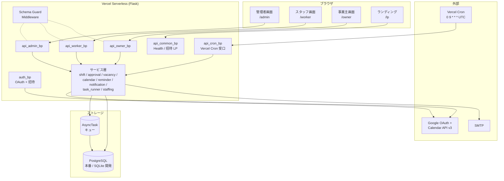
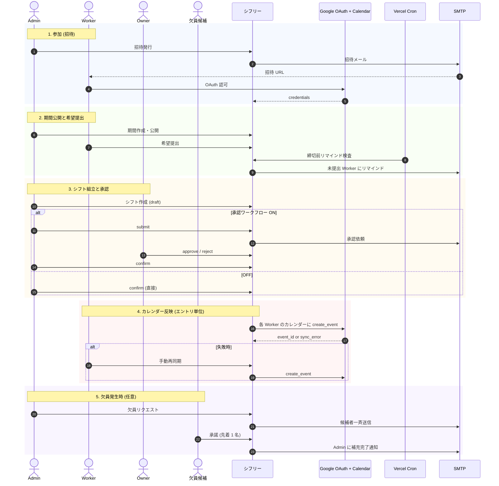

<div align="center">

# シフリー (Shifree)

<p align="center">
  
  
  
  
</p>

**Googleカレンダーと連携し、シフトの提出・作成・承認・確定までを完結する Web アプリケーション**

希望提出 / シフト構築 / 承認ワークフロー / カレンダー自動同期 / 欠員補充 / 多店舗運用


[ランディングページ](https://shifree.com/lp) ・ [アプリを使う](https://shifree.com)

</div>

---

> 飲食店・小売・小規模塾など 3〜30 名規模のチームを想定し、LINE → Excel → 口頭共有 という従来のフローを Google カレンダー 1 つに集約することを設計目標にしている。学習塾「Onedrop」での 12 名パイロット導入を経て本番運用中。

## 目次

- [何を解決するか](#何を解決するか)
- [システム全体像](#システム全体像)
- [ロール構成](#ロール構成)
- [月次ライフサイクル俯瞰](#月次ライフサイクル俯瞰)
- [機能ハイライト](#機能ハイライト)
- [設計上のハイライト](#設計上のハイライト)
- [技術スタック](#技術スタック)
- [リポジトリ構成](#リポジトリ構成)
- [機能別シーケンス図](#機能別シーケンス図)
- [クイックスタート](#クイックスタート)
- [運用ステータス](#運用ステータス)
- [関連ドキュメント](#関連ドキュメント)
- [ライセンス](#ライセンス)

---

## 何を解決するか

| 現状の課題 | シフリーの解決 |
|---|---|
| LINE グループでシフト希望を個別に集める | ワーカー画面のカレンダー UI で一括提出、未提出者には自動リマインド |
| Excel で毎月シフト表を手作りする | 月間カレンダー上で割当をクリック、充足状況・週間勤務時間がリアルタイム可視化 |
| 確定シフトの共有を毎回連絡する | 確定操作で各ワーカーの Google カレンダーに自動でイベントが入る |
| 急な欠員対応が口頭・電話で属人化する | 候補者を週間勤務時間の少ない順に自動抽出、メールリンクから先着で承諾 |
| 業務とプライベートのカレンダーが分かれている | 別 Google アカウントを読み取り専用で連携、両方の予定を見て空きを判定 |

---

## システム全体像



---

## ロール構成

| ロール | 主な権限 | 触る画面 |
|---|---|---|
| **管理者 (admin)** | シフト期間管理、スケジュール構築、メンバー管理・招待、営業時間・必要人数設定、欠員補充 | `/admin` |
| **事業主 (owner)** | スケジュール承認 / 差戻し（承認ワークフロー ON のときのみ） | `/owner` |
| **スタッフ (worker)** | シフト希望提出、確定シフト確認、Google カレンダー連携、マルチアカウント連携、手動同期 | `/worker` |
| **マスター (master)** | 全組織横断のシステム管理（環境変数 `MASTER_EMAIL` で指定） | `/master` |

ロールは DB 上の `OrganizationMember` テーブルが正で、`User.role` は同期コピー。`@require_role` ミドルウェアで API レベルから強制している（マルチテナント分離）。

---

## 月次ライフサイクル俯瞰

実装ファイル (`app/blueprints/`, `app/services/`) を根拠に作成済みのシーケンス図から、月次サイクル全体を抜粋。詳細は [docs/sequence-diagrams/00-overview.md](docs/sequence-diagrams/00-overview.md)。



---

## 機能ハイライト

### ロール別

| ロール | 主な機能 |
|---|---|
| 管理者 | 営業時間・例外日管理、必要人数 (StaffingRequirement) 設定、シフト期間の作成・公開・アーカイブ・完全削除、提出状況確認、未提出者への手動リマインド、シフト構築 (カレンダー UI)、承認依頼、確定、欠員補充、メンバー招待 (個別メール / 招待コード / QR)、ロール変更、リマインダー設定 |
| スタッフ | Google カレンダーから空き時間を自動計算、出勤可否トグル、希望提出、確定シフト一覧 (同期状態バッジ付き)、未同期シフトの個別 / 一括手動同期、別 Google アカウントの読み取り専用連携 |
| 事業主 | 承認待ち一覧、コメント付き承認 / 差戻し |
| マスター | 全組織横断のユーザー / 組織 / タスク監視、ヘルスチェック、監査ログ |

### システム

- **認証 / RBAC** — Google OAuth 2.0、招待トークン (`secrets.token_urlsafe(32)` で 256-bit エントロピー)、招待コード / QR、`OrganizationMember` 駆動の DB ロール管理、`@require_auth` / `@require_role` ミドルウェア、組織未参加ユーザーの遮断
- **カレンダー同期** — 営業時間の双方向同期、確定シフトの自動登録、エントリ単位での `sync_status` 追跡 (synced / reauth_required / failed / pending)、エラーコード分類 (`CREDENTIALS_EXPIRED` / `NO_CREDENTIALS` / `CALENDAR_API_ERROR`)、スタッフ自力復旧導線
- **マルチアカウント連携** — `LinkedCalendarAccount` で別 Google アカウント (プライベート用等) のカレンダーを読み取り専用 (`calendar.readonly`) で参照、`refresh_token` を Fernet 暗号化して保存
- **非同期処理** — `AsyncTask` キュー、指数バックオフリトライ、Vercel Cron (`0 9 * * *` UTC) からの定期消化、handler レジストリ方式
- **リマインダー** — 提出期限前 / シフト前日の自動通知、`UniqueConstraint(type, reference, user)` での重複排除、Cron 自動実行 + 管理者からの手動リマインド
- **欠員補充** — 候補者自動抽出 (週間勤務時間の少ない順)、トークン付きメールリンクで先着承諾、レースコンディション防止 (compare-and-swap)、変更履歴 (`ShiftChangeLog`) 記録
- **承認ワークフロー** — 組織単位で ON/OFF 切替、最後の owner / admin 保護、自分自身のロール降格防止、楽観ロック (`SCHEDULE_VERSION_MISMATCH`、409 で衝突検出)
- **必要人数管理** — 期間 × 日 × 時間帯ごとの最小人数を設定、シフト構築画面で充足率を可視化
- **Schema Governance** — 起動時 revision キャッシュ + `/health/schema` で本番 DB スキーマと alembic head の乖離を検出 ([ADR 0002](docs/decisions/0002-schema-mismatch-fail-fast-middleware.md))
- **セキュリティ** — Flask-Limiter / CORS 本番フェイルクローズ / CSP / HSTS / `refresh_token` の Fernet 暗号化 / 招待トークンの Cookie 受け渡し (itsdangerous 署名 + HttpOnly + 10 分 max_age)
- **PWA 対応** — `manifest.json` + Service Worker
- **観測性** — `audit_log` テーブル、運用ダッシュボード API (タスク成功率 / 承認統計 / 監査ログ)
- **自動テスト** — pytest 387 件

---

## 設計上のハイライト

1. **マルチテナント強制をミドルウェアに集約**
   - `@require_auth` / `@require_role` が `OrganizationMember` のアクティブ状態を検査し、組織未参加ユーザーは `/no-organization` ページに退避。サービス層・ブループリント層は組織 ID の漏洩を考慮せずに済む。
2. **カレンダー同期を独立サブシステムに昇格**
   - 同期状態をスケジュール全体ではなくエントリ単位で追跡し、エラーコードを 3 分類で運用判別。スタッフが自分の認証状態だけで失敗エントリを救済できる。
3. **Schema Governance を ADR で運用化**
   - 本番障害（cold-start auto-migration の競合）を契機に、CI/CD でのマイグレーション + `/health/schema` での乖離検出に切替（[ADR 0001](docs/decisions/0001-replace-cold-start-auto-migration-with-cicd.md) / [ADR 0002](docs/decisions/0002-schema-mismatch-fail-fast-middleware.md)）。runtime からの自動マイグレーションを撤廃し、起動時 revision を process-local cache。
4. **欠員補充のレースコンディションを compare-and-swap で防止**
   - 先着 1 名の承諾を保証するため、`VacancyRequest.status` の更新を「現在値が `notified` の場合のみ `accepted` に更新」する条件付き UPDATE で実装。後発の承諾は HTTP レスポンスで明示的に拒否。
5. **管理者フロントエンドを 11 ES Module に分割**
   - 元 3,451 行の `admin-app.js` を `static/js/admin/` 配下の 11 モジュール (builder / periods / members / settings / vacancy / share / sync / opening-hours / state / dirty-tracker / tabs) に分割（89% 行数削減、12 PR）。dirty 状態管理・タブ間通信を独立化し、新機能追加の影響範囲を局所化。

---

## 技術スタック

| レイヤー | 採用技術 | 採用理由 |
|---|---|---|
| バックエンド | Python 3.9+ / Flask 3.1.1 | サーバーレス互換、薄いフレームワークでルーティング・ミドルウェアを自前で組める |
| ORM / Migration | SQLAlchemy / Flask-Migrate (Alembic) | 開発 SQLite と本番 PostgreSQL で同一スキーマを保証、revision での乖離検出が可能 |
| DB | SQLite (開発) / PostgreSQL (本番) | 開発体験と本番堅牢性の両立、Vercel Postgres (Neon) を本番採用 |
| 認証 | Google OAuth 2.0 | チーム向け業務アプリで初回ログインの摩擦が最小、Calendar API のスコープも一括取得 |
| 外部 API | Google Calendar API v3 | 既存の業務カレンダーへ確定シフトを書き戻すため必須 |
| セッション | Flask-Session (SQLAlchemy backend) | サーバーレスで複数インスタンスをまたがるセッション保持 |
| セキュリティ | Flask-Limiter / Flask-CORS / cryptography (Fernet) | レート制限、本番 CORS フェイルクローズ、`refresh_token` の対称鍵暗号化 |
| フロントエンド | Vanilla HTML / CSS / JS (ES Modules) | フレームワーク依存なし、ロール別ページで分割、ビルドステップなし |
| デプロイ | Vercel Serverless (Python Runtime) + Vercel Cron | コールドスタート許容、Hobby プラン Cron (1 日 1 回) で運用 |
| テスト | pytest | バックエンドのみ、ロール別 API・状態遷移・マイグレーションを網羅 |

---

## リポジトリ構成

```
shift-scheduler-app/
├── api/
│   └── index.py                          # Vercel エントリポイント (create_app() ラップ)
├── app/                                  # Flask アプリケーション本体
│   ├── __init__.py                       # アプリケーションファクトリ
│   ├── config.py                         # 環境別設定
│   ├── extensions.py                     # Flask 拡張
│   ├── blueprints/                       # ルーティング層 (9 個)
│   │   ├── auth.py                       # Google OAuth + 招待トークン受入
│   │   ├── api_admin.py                  # 管理者 API
│   │   ├── api_worker.py                 # スタッフ API
│   │   ├── api_owner.py                  # 事業主 API
│   │   ├── api_calendar.py               # カレンダー同期 API
│   │   ├── api_common.py                 # ヘルスチェック・招待 LP・欠員応答
│   │   ├── api_cron.py                   # Vercel Cron 受口 (CRON_SECRET 認証)
│   │   ├── api_dashboard.py              # 運用ダッシュボード
│   │   └── api_master.py                 # マスター (横断管理)
│   ├── models/                           # SQLAlchemy モデル (11 ファイル)
│   │   ├── user.py                       # User, UserToken, LinkedCalendarAccount
│   │   ├── organization.py               # Organization (settings_json 含む)
│   │   ├── membership.py                 # OrganizationMember, InvitationToken
│   │   ├── opening_hours.py              # OpeningHours, 例外日, 同期ログ
│   │   ├── shift.py                      # ShiftPeriod, Submission, Schedule, Entry
│   │   ├── staffing.py                   # StaffingRequirement (必要人数)
│   │   ├── approval.py                   # ApprovalHistory
│   │   ├── async_task.py                 # AsyncTask (非同期キュー)
│   │   ├── reminder.py                   # Reminder (重複排除制約付き)
│   │   ├── vacancy.py                    # VacancyRequest, Candidate, ChangeLog
│   │   └── audit_log.py                  # AuditLog
│   ├── services/                         # ビジネスロジック (12 ファイル)
│   │   ├── auth_service.py
│   │   ├── shift_service.py
│   │   ├── approval_service.py
│   │   ├── calendar_service.py
│   │   ├── opening_hours_sync_service.py
│   │   ├── notification_service.py       # メール通知 (非同期キュー対応)
│   │   ├── task_runner.py                # ジョブ消化 (指数バックオフリトライ)
│   │   ├── reminder_service.py
│   │   ├── vacancy_service.py
│   │   ├── staffing_service.py
│   │   ├── organization_settings.py      # 組織設定 (level / overlap / staffing) CRUD
│   │   └── audit_service.py
│   ├── middleware/
│   │   ├── auth_middleware.py            # @require_auth, @require_role
│   │   └── schema_guard.py               # スキーマ乖離検出 (ADR 0002)
│   └── utils/
│       ├── errors.py                     # APIError, error_response (code フィールド標準化)
│       ├── time_utils.py
│       └── validators.py
├── static/                               # フロントエンド一式
│   ├── pages/                            # ロール別 HTML + LP
│   ├── js/
│   │   ├── admin/                        # 管理者 SPA (11 ES Module)
│   │   │   ├── builder.js
│   │   │   ├── periods.js
│   │   │   ├── members.js
│   │   │   ├── settings.js
│   │   │   ├── vacancy.js
│   │   │   ├── share.js
│   │   │   ├── sync.js
│   │   │   ├── opening-hours.js
│   │   │   ├── state.js
│   │   │   ├── dirty-tracker.js
│   │   │   └── tabs.js
│   │   ├── modules/                      # 共通モジュール (api-client / calendar-grid 等)
│   │   ├── worker-app.js
│   │   ├── owner-app.js
│   │   └── ...
│   ├── css/                              # ロール別 CSS
│   ├── icons/                            # PWA アイコン
│   ├── manifest.json                     # PWA マニフェスト
│   └── sw.js                             # Service Worker
├── migrations/                           # Alembic マイグレーション (13 revision)
├── tests/                                # pytest テストスイート (387 件)
├── docs/                                 # 設計ドキュメント
│   ├── system-overview.md                # L1 システム概要
│   ├── functional-spec.md                # L2 機能仕様
│   ├── technical-spec.md                 # L3 技術仕様
│   ├── sequence-diagrams/                # 機能別シーケンス図 (00-07)
│   ├── decisions/                        # ADR (Architecture Decision Records)
│   ├── lp-redesign-v2/                   # LP 再設計の履歴
│   └── notes/                            # 調査メモ・運用ログ
├── scripts/                              # 運用スクリプト
├── wsgi.py                               # ローカル開発エントリポイント
├── pytest.ini                            # pytest 設定
├── requirements.txt                      # 依存関係
├── vercel.json                           # ルーティング + Cron 設定
├── CLAUDE.md                             # 開発者向けプロジェクトメモリ
└── LICENSE
```

---

## 機能別シーケンス図

`app/blueprints/` と `app/services/` を根拠に作成済み。各図は「人間がシステムとどう関わるか」の切り口。

| # | フロー | 主要アクター | 技術ポイント | リンク |
|---|---|---|---|---|
| 00 | 全体俯瞰 (月次サイクル) | 全ロール + 外部サービス | フェーズ分割で 1 ヶ月の流れを 1 枚に | [overview](docs/sequence-diagrams/00-overview.md) |
| 01 | 新規メンバー参加 (4 経路) | 招待者 / 新規ユーザー / Google | メール招待 / 招待コード / QR / ブートストラップ | [onboarding](docs/sequence-diagrams/01-onboarding.md) |
| 02 | スタッフの月次サイクル | Worker | Google カレンダー Free/Busy 連動による空き時間自動計算 | [worker-monthly-flow](docs/sequence-diagrams/02-worker-monthly-flow.md) |
| 03 | 承認プロセス (ON/OFF 分岐) | Admin / Owner | 承認ワークフロー設定駆動、楽観ロック | [owner-approval](docs/sequence-diagrams/03-owner-approval.md) |
| 04 | 管理者の運営サイクル | Admin / Worker / Owner | 期間作成 → 提出収集 → 構築 → 確定 | [admin-operation-cycle](docs/sequence-diagrams/04-admin-operation-cycle.md) |
| 05 | カレンダー同期と復旧 | Admin / Worker / Google | エントリ単位の sync_status、スタッフ自力復旧 | [calendar-sync-recovery](docs/sequence-diagrams/05-calendar-sync-recovery.md) |
| 06 | 欠員募集 | Admin / 候補 Worker | 候補者抽出 → メールリンク → 先着 (CAS) | [vacancy-request](docs/sequence-diagrams/06-vacancy-request.md) |
| 07 | バックグラウンドジョブ | Vercel Cron / 受信側ユーザー | 非同期キュー消化、リマインダー二系統 | [background-jobs](docs/sequence-diagrams/07-background-jobs.md) |

---

## クイックスタート

### 前提

- Python 3.9 以上
- Google Cloud Console で OAuth 2.0 クライアント ID を作成済み (Calendar API 有効化)
- (本番のみ) PostgreSQL データベース、SMTP サーバー

### ローカル開発

```bash
git clone https://github.com/tatsunoritojo/shift-scheduler-app.git
cd shift-scheduler-app
pip install -r requirements.txt
```

`.env` を作成:

```env
GOOGLE_CLIENT_ID=your_client_id
GOOGLE_CLIENT_SECRET=your_client_secret
GOOGLE_REDIRECT_URI=http://localhost:5000/auth/google/callback
SECRET_KEY=your_secret_key
ADMIN_EMAIL=admin@example.com
OWNER_EMAIL=owner@example.com
SESSION_COOKIE_SECURE=0
```

> Google Cloud Console > 認証情報 で OAuth 2.0 クライアントを作り、リダイレクト URI に `http://localhost:5000/auth/google/callback` を追加。

```bash
flask db upgrade        # マイグレーション適用
python wsgi.py          # 開発サーバー起動
pytest                  # テスト実行 (387 件)
```

`http://localhost:5000` にアクセス。`ADMIN_EMAIL` / `OWNER_EMAIL` に設定したメールでログインすると、初回ブートストラップで管理者 / 事業主として参加。

### Vercel デプロイ

```bash
vercel              # プロジェクトをインポート
vercel --prod       # 本番デプロイ
```

環境変数 (Vercel ダッシュボード > Settings > Environment Variables):

| 変数 | 用途 |
|---|---|
| `GOOGLE_CLIENT_ID` / `GOOGLE_CLIENT_SECRET` | OAuth クライアント |
| `GOOGLE_REDIRECT_URI` | `https://<your-domain>/auth/google/callback` |
| `SECRET_KEY` | セッション署名 |
| `DATABASE_URL` | PostgreSQL 接続文字列 (本番は unpooled URL を migration 用に別途確保推奨) |
| `ADMIN_EMAIL` / `OWNER_EMAIL` | ブートストラップ用 (カンマ区切り可) |
| `MASTER_EMAIL` | マスター画面アクセス用 |
| `CRON_SECRET` | `/api/cron/*` 認証トークン (HMAC 比較) |
| `FERNET_KEY` | `refresh_token` 暗号化鍵 |
| `CORS_ALLOWED_ORIGINS` | 本番フェイルクローズ (未設定なら全拒否) |
| `SMTP_HOST` / `SMTP_PORT` / `SMTP_USER` / `SMTP_PASS` | メール通知 (任意) |

> Vercel Cron のタイムゾーンは常に UTC（[公式 docs](https://vercel.com/docs/cron-jobs#cron-expressions)）。Hobby プランは 1 日 1 回のみ + 指定時刻の 1 時間幅で発火する仕様（[公式 docs](https://vercel.com/docs/cron-jobs/manage-cron-jobs#cron-jobs-accuracy)）。`vercel.json` の `0 9 * * *` は UTC 09:00〜09:59 帯（JST 18:00〜18:59 帯）のどこかで発火。
> Google Cloud Console のリダイレクト URI に Vercel の本番 URL を追加するのを忘れずに。

### 主要 URL

| パス | 用途 |
|---|---|
| `/lp` | ランディングページ |
| `/login` | ログイン |
| `/admin` / `/worker` / `/owner` / `/master` | ロール別画面 |
| `/invite?code=X` or `?token=X` | 招待リンク受口 |
| `/no-organization` | 組織未参加ユーザー案内 |
| `/vacancy/respond` | 欠員補充の応答 (ログイン不要) |
| `/health` | ヘルスチェック |
| `/health/schema` | スキーマ乖離検出 (ADR 0002) |

---

## 運用ステータス

- **本番稼働中** — 学習塾「Onedrop」アルバイト 12 名のパイロット導入を経て本番運用中（2026-03〜）
- **テスト** — pytest 387 件、CI で自動実行
- **Schema Governance** — ADR 0001 / 0002 Accepted、`/health/schema` 本番で `match=true` 維持中
- **進行中の機能フェーズ** — Admin Redesign Phase A → A'-1 完了、A'-2 (owner 承認画面強化) 検討中
- **既知の制約** — Vercel Hobby プランで Cron は 1 日 1 回のみ + 1 時間幅で発火

---

## 関連ドキュメント

| ドキュメント | 内容 |
|---|---|
| [docs/system-overview.md](docs/system-overview.md) | L1 システム概要 (関係者全員向け) |
| [docs/functional-spec.md](docs/functional-spec.md) | L2 機能仕様 (画面・状態遷移・ビジネスルール) |
| [docs/technical-spec.md](docs/technical-spec.md) | L3 技術仕様 |
| [docs/sequence-diagrams/](docs/sequence-diagrams/) | 機能別シーケンス図 (00-07) |
| [docs/decisions/](docs/decisions/) | ADR (Architecture Decision Records) |
| [CLAUDE.md](CLAUDE.md) | 開発者向けプロジェクトメモリ (作業中タスク・着手手順) |

---

## ライセンス

MIT License — [LICENSE](LICENSE) 参照。
