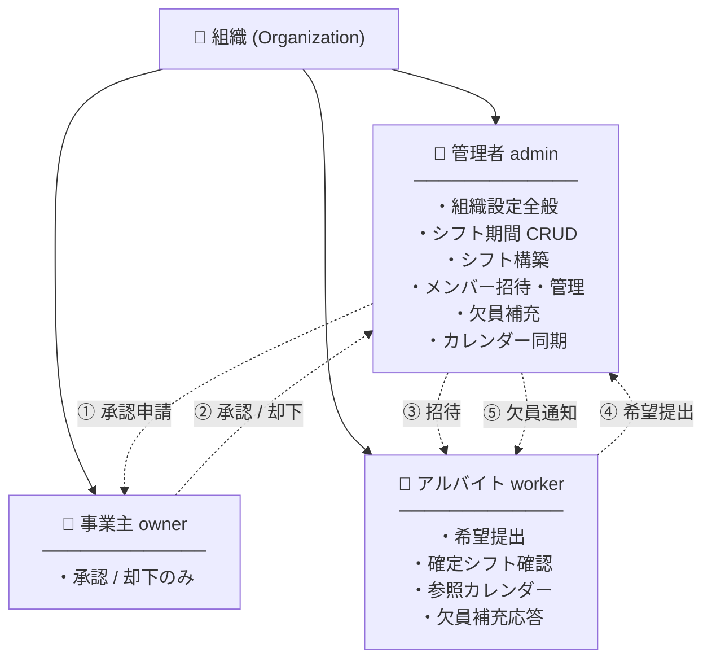
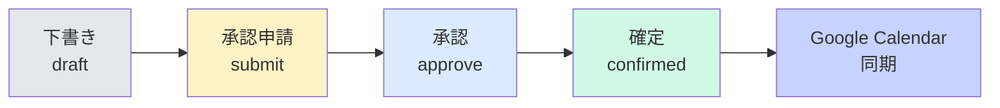
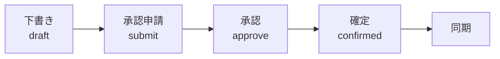
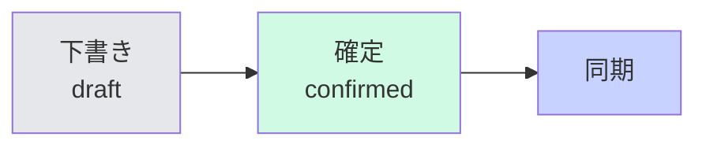

# 組織構造再設計プラン

策定日: 2026-04-20
関連文書: [admin-redesign-plan.md](admin-redesign-plan.md)

## 0. 本書の位置づけ

Shifree の役割設計（admin / owner / worker）と承認フローの再定義。
`admin-redesign-plan.md` の Phase A〜G とは独立した論点として扱い、決定後に
Phase A' として管理者画面再設計計画に差し戻す。

## 1. 現状の組織構造

### 1-1. 3ロールの固定構造



### 1-2. 固定の承認フロー



すべての組織でこの4段階を強制。

## 2. 観察される問題

| # | 問題 | 影響 |
|---|---|---|
| 1 | owner が常に必要な設計 | 一人で運営する個人事業主や小規模店には過剰なフロー |
| 2 | owner の情報可視性が低い | 「承認ボタン押すだけ」の存在。経営判断に必要な全体像にアクセスしづらい |
| 3 | admin が経営判断まで持ちすぎ | レベル定義・最低出勤契約の閾値など、本来経営者領域の設定を admin が管理 |
| 4 | owner 招待の発見性が低い | メンバー管理タブのドロップダウン内に埋もれ、初見で気付けない |
| 5 | owner 不在時のフォールバックなし | 組織に owner ロールのメンバーがいないと承認申請がブロック |

## 3. 理想構造: 承認プロセス設定

### 3-1. ON/OFF トグル

設定タブに以下のカードを追加:

```
┌──────────────────────────────────────────────┐
│ 🔐 管理者の承認プロセスを設定する            │
├──────────────────────────────────────────────┤
│ ☐ 承認プロセスを有効にする                   │
│                                              │
│ 有効時: 管理者がシフトを確定する前に、       │
│         事業主の承認が必要になります。       │
│ 無効時: 管理者のみでシフトを確定できます。   │
└──────────────────────────────────────────────┘
```

ON/OFF という二分が UX として自然。OFF なら「承認プロセスを設定していない」状態として解釈できる。

### 3-2. 設定スキーマ

```json
{
  "workflow": {
    "approval_required": false
  }
}
```

- **デフォルト**: 新規組織は `false`
- **既存組織の挙動**: owner メンバーが存在する組織は自動的に `true`、なければ `false`
- **切替**: admin が設定タブから切替可能。`true` に切替える場合、owner が1名以上必要

### 3-3. ON/OFF での挙動差

| 項目 | OFF（承認プロセスなし） | ON（承認プロセス有り） |
|---|---|---|
| owner ロール | 任意（不在でOK） | 必須（最低1名） |
| シフト確定フロー | 保存 → そのまま確定 | 下書き → 承認申請 → 承認 → 確定 |
| 進捗バー | 3段階（下書き/確定/同期済み） | 4段階（現行） |
| UI: 承認申請ボタン | 非表示 | 表示 |
| UI: 確定ボタン | 「シフトを確定」（単一操作） | 「確定・カレンダー同期」（現行） |
| 承認通知 | なし | owner へメール送信 |

### 3-4. 承認フロー（モードB 時の既存挙動保持）



### 3-5. シンプル運用フロー（モードA 時）



## 4. owner 招待のオンボーディング改善

### 4-1. モードB を選んだ直後のガイド

設定タブで「承認フローを有効にする」→ owner 不在なら即座にカード表示:

```
┌─────────────────────────────────────────────┐
│ ⚠️ 事業主が未設定です                        │
├─────────────────────────────────────────────┤
│ 承認フローを有効にしましたが、承認者となる  │
│ 事業主がまだ組織にいません。以下から招待:   │
│                                             │
│ [メールアドレス_______] [事業主を招待する]  │
└─────────────────────────────────────────────┘
```

### 4-2. メンバー管理タブの独立セクション

現行: 「個別招待」セクション内でロールを選ぶだけ
改善: モードB のとき、メンバー管理タブ上部に「事業主の招待」独立カードを配置

### 4-3. 招待ダイアログのヘルプ

ロール選択の「事業主」オプション横に `(?)` アイコンを配置し、tooltip または popover で役割説明:

> **事業主 (owner)**
> シフトの最終承認を行います。組織に1名以上必要です（承認フロー有り時）。
> 普段のシフト作成や設定変更は管理者が行いますが、確定前のチェック権限を持ちます。

### 4-4. ダッシュボード（Phase D）でのアラート

モードB かつ owner 不在の場合、ダッシュボードの要対応リスト最上位に赤バナーで警告:

> 🚨 事業主が未設定のため、承認申請が完了しません。

## 4-bis. owner 承認画面の強化

現状の owner 画面は「承認/差戻す」の判定には使えるが、経営判断に必要な俯瞰情報が不足している。

### 4-bis-1. 現状の表示

- 期間・ステータス・作成日
- シフト一覧テーブル（日付・曜日・スタッフ・時間）
- 勤務時間集計テーブル（スタッフ別合計）
- 承認履歴（いつ誰が何を）
- 承認/差戻しボタン（差戻しはコメント必須）

### 4-bis-2. 不足している要素

| 要素 | 目的 |
|---|---|
| **カレンダービュー** | 期間全体の充足状況を一目で把握 |
| **充足率メトリクス** | 「今期は X% 埋まっている」のサマリー |
| **未割当スロット一覧** | 欠員の可視化 |
| **前期比較** | 「前回と比べて Y さんの出勤が減った」などの差分検知 |
| **レベル別バランス** | レベル機能ON時、時間帯ごとのレベル分布 |
| **承認待ち一覧** | 複数期間の pending を俯瞰し、古いものから処理 |

### 4-bis-3. 改修方針（Phase A' 後半）

owner 画面を admin の「日付詳細ポップアップ」と同じカレンダー UI に寄せ、以下を追加:

- メインカレンダー（admin の `renderBuilderCalendar()` を共有コンポーネント化）
- サマリーカード（充足率・未割当日数・警告件数）
- 差戻しダイアログの UX 改善（よくある理由のプリセット・テンプレート）

## 5. エッジケース・矛盾防止の強化

### 5-1. 現状の実装漏れ

Phase A' 導入に合わせて **以下の保護を追加** する。

| # | リスク | 対応 |
|---|---|---|
| 🔴 | 最後の owner 保護なし（承認フロー有り時） | `/members/{id}/role` PUT・DELETE に追加: `approval_required=true` かつ対象が最後の active owner なら拒否 |
| 🔴 | pending_approval 中の owner 除外 | owner 除外時に該当組織の pending スケジュール件数を返し、存在すれば警告ダイアログ |
| 🟡 | 自分自身のロール降格 | `/members/{id}/role` PUT に自己変更ガード追加（現在は削除のみ防止）|
| 🟡 | 複数 admin の同時編集競合 | `ShiftSchedule.updated_at` を楽観ロックキーとして送受信、不一致なら 409 + reload 案内 |
| 🟡 | 複数 owner の承認ポリシー | 「いずれか1名の承認で確定」を明文化（現行実装通り、doc + UI で明示） |
| 🟡 | pending_approval 中の creator 降格 | 承認処理時に creator の role を検証、降格済みなら status を draft に巻き戻し + 通知 |
| 🟡 | 除外済みメンバーの継続アクセス | `require_role` で OrganizationMember.is_active もチェック（既にある場合は確認） |

### 5-2. 複数 admin / 複数 owner の設計方針

**複数 admin**:
- 許容する（現行通り）
- 大規模店舗では店長＋副店長のような構造を想定
- 同時編集の競合は楽観ロックで検知 → 再読込を促す

**複数 owner**:
- 許容する（現行通り）
- 承認は **いずれか1名** で成立（全員一致ではない）
- 承認履歴には「誰が承認したか」を残す
- UI で「承認待ち → 誰でも承認可能」と明示

### 5-3. 同一ユーザーの重複ロール

- 1組織内で同一ユーザーが admin かつ owner を兼任する設計は現状不可（`UniqueConstraint(user_id, org_id)`）
- 小規模店舗では「管理者 兼 事業主」のニーズあり → **承認プロセスOFF** にすれば実質兼任可能
- 将来的にロールの多対多化は検討するが、Phase A' では対応しない

## 6. 役割と責任の再定義（将来検討）

**注:** この節は将来課題。モード導入（優先）と分離して検討。

### 5-1. 本来の責任分担

| 領域 | 現状 | 理想（検討中） |
|---|---|---|
| 組織設定（名称・モード） | admin | owner（経営判断） |
| 雇用条件（最低出勤） | admin | owner |
| レベル定義（スキル体系） | admin | owner |
| 営業時間・休業日 | admin | admin（現場運営） |
| リマインダー設定 | admin | admin |
| シフト期間 CRUD | admin | admin |
| シフト構築 | admin | admin |
| メンバー招待 | admin | owner + admin 両方 |
| カレンダー同期 | admin | admin |

### 5-2. 検討時の論点

- モードA（owner 不在）の場合、「owner 限定」項目は誰が触る？
  → モードA では admin が全権限を持つ（現行通り）
- モードB で owner が離脱したら？
  → owner が0名になると自動でモードA にフォールバック、または admin を代行昇格？

この節は Phase A' 実装後、運用フィードバックを踏まえて決定する。

## 7. マイグレーション方針

### 6-1. 既存組織のモード自動判定

組織モード切替カラム追加時、以下のロジックで初期値を設定:

```python
def determine_initial_mode(org):
    has_owner = OrganizationMember.query.filter_by(
        organization_id=org.id, role='owner', is_active=True
    ).count() > 0
    return 'approval_required=true' if has_owner else 'approval_required=false'
```

既存の運用を壊さないため、owner が既に設定されている組織は自動的にモードB となる。

### 6-2. モード切替時の制約

- モードA → モードB: owner がいないと切替不可（招待ダイアログを開かせる）
- モードB → モードA: 進行中の承認申請があれば切替前に確認ダイアログ
- モードA のまま owner を招待することは可能（将来モードB に切替える準備として）

## 8. 実装フェーズ位置付け

`admin-redesign-plan.md` の Phase 順序に挟み込む:

```
Phase A: 設定基盤 (DONE)
Phase A': 組織モード導入 ← NEW (この文書で定義)
Phase B: 割当画面強化
Phase C: IA 器
Phase D: ダッシュボード
...
```

Phase A' の作業見積:

| 項目 | 作業 |
|---|---|
| 設定スキーマ | `workflow.approval_required` を Organization.settings_json に追加 |
| API | `GET/PUT /api/admin/settings/workflow`, モード切替時のバリデーション |
| バックエンド | `submit_for_approval`, `confirm_schedule` にモード判定追加 |
| フロント | 承認申請ボタンの条件表示、進捗バー3/4段階切替、確定ボタンの文言変更 |
| UI追加 | owner 招待の独立セクション、設定カード、ヘルプ |
| マイグレーション | 不要（settings_json のみ）。ただし初期値決定バッチは必要 |

**見積: Phase A と同程度の規模。1〜2日。**

## 9. 決定事項

- [x] ネーミング: トグル名は「管理者の承認プロセスを設定する」、ON/OFF
- [x] デフォルト: 新規組織は `false`（承認プロセスなし）
- [x] 複数 owner 時の承認: **いずれか1名** で成立
- [x] 同一ユーザーの admin+owner 兼任: Phase A' では非対応（承認プロセスOFFで代替）
- [ ] owner 不在時のフォールバック動作: 承認プロセスONかつowner不在 → 警告バナー + 切替ガイド
- [ ] 将来の権限再分配（6節）をいつ着手するか

## 10. Phase A' 最終スコープ（更新版）

1. **承認プロセス設定** — `workflow.approval_required` 追加、ON/OFF 切替 + UI条件分岐
2. **owner 招待のオンボーディング** — 設定ONかつowner不在時のガイド・独立招待セクション・ヘルプアイコン
3. **owner承認画面の強化** — カレンダー + 充足率 + 未割当 + 前期比較
4. **エッジケース保護** — 最後の owner 保護、pending 中の除外検証、自己降格防止、楽観ロック等（5-1の7項目）

Phase A の1.5〜2倍の規模。2〜3日。

## 更新履歴

- 2026-04-20: 初版策定（admin/owner 議論から派生）
- 2026-04-21: ネーミング決定（承認プロセスON/OFF）、owner承認画面強化・エッジケース強化節を追加
- 2026-04-21: **Phase A'-1 実装完了**（承認プロセス設定、エッジケース保護、owner招待オンボーディング）

## 実装状況

### Phase A'-1 完了（2026-04-21）

- ✅ `workflow.approval_required` 設定（Organization.settings_json）
- ✅ API: GET/PUT `/api/admin/settings/workflow`
- ✅ API: GET `/api/admin/members/{id}/role-change-impact`（影響プリフライト）
- ✅ 承認フロー分岐（`confirm_schedule_direct` 追加、draft → confirmed 直接遷移）
- ✅ 承認プロセスOFF時、submit エンドポイントをブロック（APPROVAL_DISABLED）
- ✅ 最後の owner 保護（ON時に降格/除外を拒否）
- ✅ 自分自身のロール降格防止
- ✅ 楽観ロック（ShiftSchedule.updated_at を schedule_version として往復）
- ✅ 管理者UI: workflow 設定カード、owner不在バナー
- ✅ メンバー管理UI: 独立した事業主招待カード（条件付き表示）
- ✅ 進捗バー: 3段階（OFF）/ 4段階（ON）の切替
- ✅ 確定ボタンのラベル: OFF時「シフトを確定・カレンダー同期」、ON時「確定・カレンダー同期」
- ✅ 既存テスト 313 + 新規 25 = 338 passing

### A'-1 で未対応（将来検討）

- owner 承認画面の強化（カレンダービュー・充足率・前期比較）→ **A'-2 として別コミット**
- 複数 owner の承認ポリシー明文化（現行「いずれか1名」動作は保持）
- pending 中 creator 降格検証（実害小）
