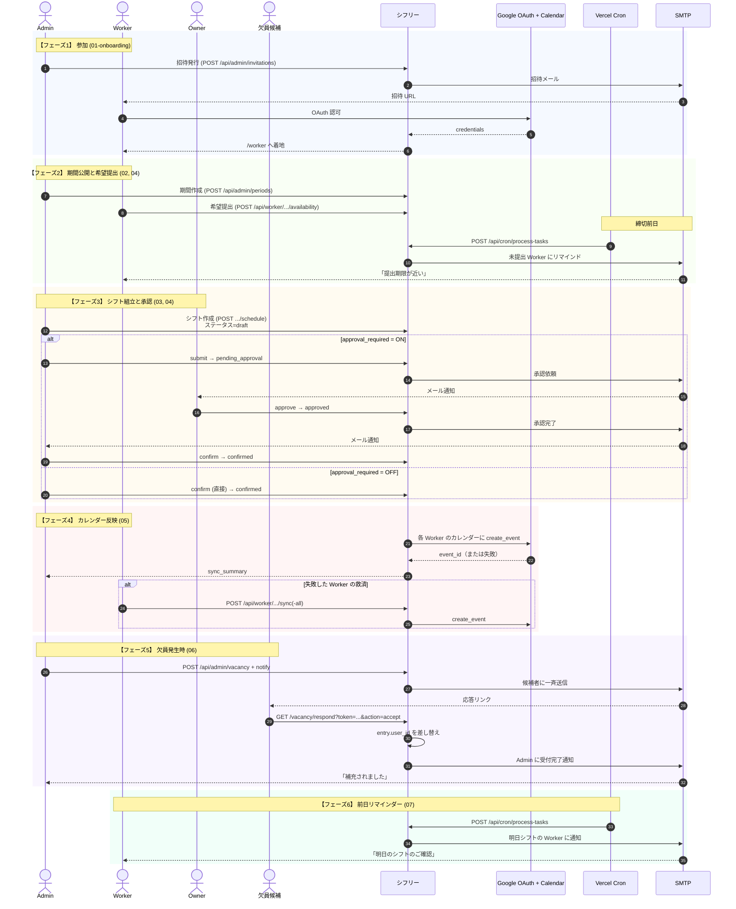
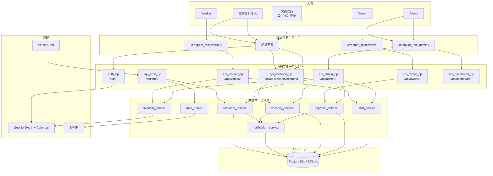

# 00. 全体俯瞰

ひと月の運営サイクルを通して、**各ロールがどのタイミングでシステムに関わるか** をひと目で掴むための俯瞰図。細部は個別図 (01-07) を参照。

## 登場する人間と役割

| アクター | 主な役割 | 触る画面 |
|---|---|---|
| **Admin** | シフト作成、メンバー管理、確定操作 | `/admin` |
| **Owner** | シフト承認（承認 ON のときのみ） | `/owner` |
| **Worker** | 希望提出、確定受領、カレンダー同期 | `/worker` |
| **招待される人** | 参加手続き | `/invite` → `/callback-landing` |
| **欠員候補** | メールリンク応答 | `/vacancy/respond`（ログイン不要） |

## サブシステム

| サブシステム | 役割 |
|---|---|
| **Flask アプリ本体** | ブラウザからのリクエストを受け付け、DB と外部 API を橋渡し |
| **PostgreSQL (prod) / SQLite (dev)** | ユーザー、組織、シフト、承認履歴、通知ログ |
| **Google OAuth 2.0** | 認証 + Calendar API のアクセストークン |
| **Google Calendar** | 確定シフトのイベント書き込み |
| **AsyncTask キュー** | 通知メールの非同期配信 |
| **Vercel Cron** | 日次トリガー（通知配信・リマインダー） |
| **SMTP** | メール配信 |

---

## ライフサイクル俯瞰（月次サイクル）

---

## アクセス経路マップ（誰がどのエンドポイントを叩くか）

---

## 1 日の中の時間軸

実運用での典型的な 1 日の流れ。

```mermaid
gantt
    title 1 日のシステム内イベント（例: 月末前日）
    dateFormat  HH:mm
    axisFormat  %H:%M

    section 自動
    Vercel Cron 起動 (process-tasks)  :milestone, cron, 09:00, 0m
    締切前リマインダー検査 + 送信       :active, 09:00, 5m
    前日リマインダー検査 + 送信        :active, 09:05, 5m
    AsyncTask (enqueue 済み) 消化    :active, 09:00, 10m

    section Admin
    提出状況チェック                :admin1, 10:00, 15m
    シフト作成                     :admin2, after admin1, 2h
    submit (承認 ON)              :milestone, admin3, after admin2, 0m

    section Owner
    承認メール受信                  :milestone, own1, after admin3, 0m
    承認                          :own2, after own1, 20m

    section Admin 2
    confirm + Calendar 同期       :admin4, after own2, 5m
    sync_summary 確認              :admin5, after admin4, 10m

    section Worker
    確定メール受信                  :milestone, w1, after admin4, 0m
    カレンダー確認 + 必要なら手動同期    :w2, after w1, 30m
```

- Cron の実行時刻（09:00 JST）は `vercel.json` で固定。運用タイミングはこの日次イベントに合わせて組まれる想定。

---

## ロール別の「関わり方」ダイジェスト

### Worker

- 月 1 回: 希望提出（数分）
- 月 1 回: 確定を受領し、カレンダー同期が失敗していたら手動追加（数分）
- 必要時: 欠員メールに応答（1 分）
- 日次: メールを読む

### Owner（承認 ON の場合のみ）

- 月 1 回: シフト案を確認して承認（5-30 分）
- 差し戻しあれば再確認

### Admin

- 月 1 回: 期間作成、シフト組立、確定（数時間）
- 随時: メンバー管理、欠員対応、設定調整
- 日次: 通知配信の成否を軽く確認（ダッシュボード）

### 欠員候補

- 不定期: メールリンクをクリックして応答（ログイン不要）

### 招待される人

- 初回のみ: 招待 URL → Google ログイン → アプリに着地

---

## もっと詳しく知るには

| 知りたいこと | 見るべき図 |
|---|---|
| 認証と参加の仕組み | [01-onboarding.md](01-onboarding.md) |
| Worker の毎月の操作 | [02-worker-monthly-flow.md](02-worker-monthly-flow.md) |
| 承認プロセスの分岐 | [03-owner-approval.md](03-owner-approval.md) |
| Admin の運営実務 | [04-admin-operation-cycle.md](04-admin-operation-cycle.md) |
| カレンダー同期のトラブルシュート | [05-calendar-sync-recovery.md](05-calendar-sync-recovery.md) |
| 欠員募集の race condition | [06-vacancy-request.md](06-vacancy-request.md) |
| 裏で動いている Cron | [07-background-jobs.md](07-background-jobs.md) |
