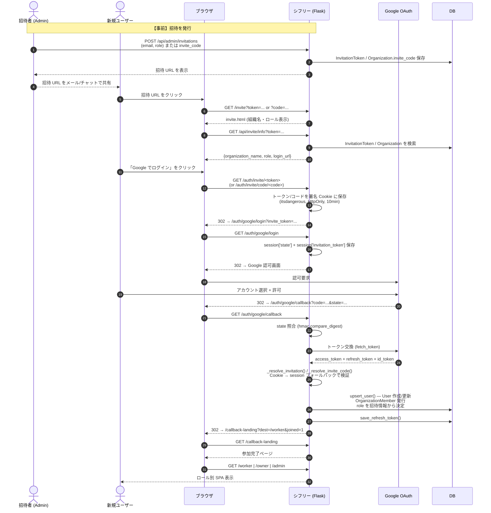
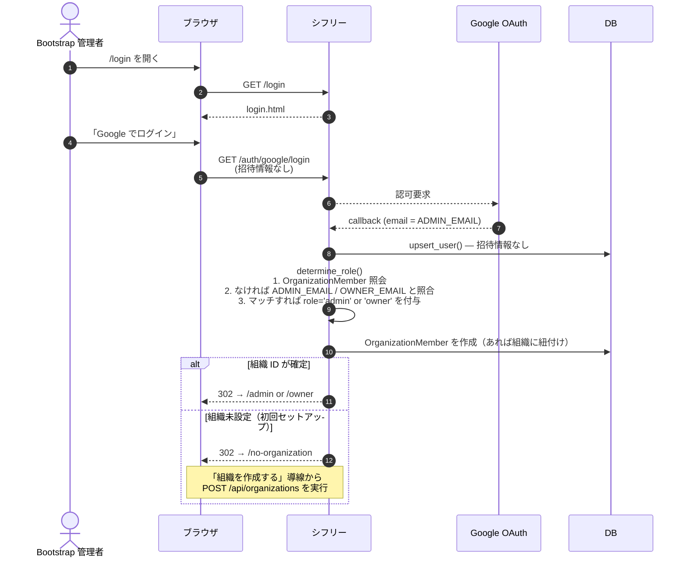
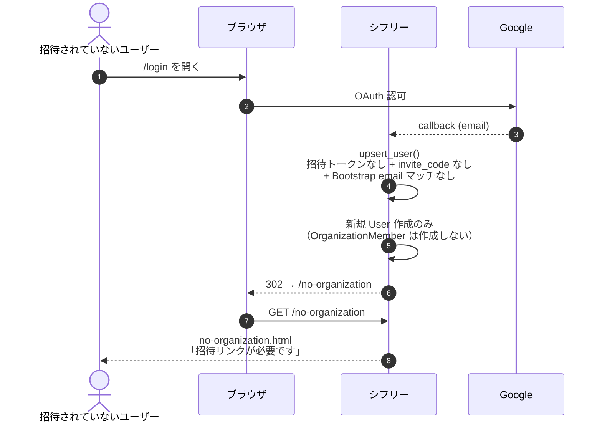

# 01. オンボーディング（新規メンバーの参加）

新規ユーザーが組織に参加するまでのフロー。招待方法は **4 経路** あり、どれを通るかでロールと所属が決まります。

## 登場する人間

- **招待者（Admin）** — 招待 URL/コードを発行する人
- **新規ユーザー** — これから参加する Worker / Owner / Admin
- **Bootstrap 管理者** — 環境変数 (`ADMIN_EMAIL` / `OWNER_EMAIL`) で設定される初期管理者（初期セットアップ時のみ）

## 4 つの参加経路

| 経路 | 発行方法 | 想定ロール | URL |
|---|---|---|---|
| **A. 個別招待トークン** | Admin が `POST /api/admin/invitations` で発行 | worker/owner/admin 任意 | `/invite?token=...` |
| **B. 組織招待コード** | 組織に固定の共有コード | worker 固定 | `/invite?code=...` |
| **C. 環境変数 Bootstrap** | デプロイ時に `ADMIN_EMAIL` / `OWNER_EMAIL` を設定 | admin / owner | ログイン時に自動判定 |
| **D. 未所属ログイン** | どの招待経路にも該当しない | 所属なし | `/no-organization` へ |

---

## シーケンス図（経路 A + B）: 招待リンク経由

### この経路の特徴

- **Cookie 優先 + Session フォールバック** — モバイルブラウザでは OAuth リダイレクト中に Cookie が消えることがあるので、`session['invitation_token']` にも保存しています (`auth.py:125-131`)。
- **メール一致チェック** — 個別招待 (経路 A) では `invite.email` と Google アカウントのメールを大文字小文字無視で比較し、一致しないとトークンを無効化します (`auth.py:266-271`)。
- **完了ランディング** — 招待経由で参加したユーザーには `/callback-landing?joined=1` を挟み、次回以降は直接ロール別ページへ飛ばします (`auth.py:245-250`)。

---

## シーケンス図（経路 C）: 環境変数 Bootstrap

招待リンクを経由しない「初期管理者」の登録。`ADMIN_EMAIL` / `OWNER_EMAIL` に設定されたメールで直接ログインすると、自動的にロールが割り当てられます。

---

## シーケンス図（経路 D）: 未所属ログイン

招待経路に該当しないユーザーは、組織に所属できず業務 API にアクセスできません。

### 業務上の意味

この経路で止められるユーザーは、**悪意なく身内のメールアドレスでログインしてしまった第三者**などを想定しています。未所属ユーザーは `require_role` ミドルウェアで業務 API からも弾かれるので、データ漏洩にはつながりません。

---

## ユーザー体験サマリー

| ロール | 参加直後に見える画面 | 受け取るメール |
|---|---|---|
| Worker（個別招待） | `/callback-landing?joined=1` → `/worker` | 招待メール（`notify_invitation_created`） |
| Worker（招待コード） | `/callback-landing?joined=1` → `/worker` | なし（コード共有は Admin が自由に行う） |
| Owner | `/callback-landing?joined=1` → `/owner` | 招待メール |
| Admin | `/callback-landing?joined=1` → `/admin` | 招待メール |
| Bootstrap | `/admin` または `/owner` 直行 | なし |
| 未所属 | `/no-organization` | なし |

## 参照

- `app/blueprints/auth.py:58-252` — OAuth フローと招待解決
- `app/services/auth_service.py` — `upsert_user()`, `determine_role()`, `save_refresh_token()`
- `app/blueprints/api_common.py:145-198` — `/invite` ランディング、`/api/invite/info`
- `app/models/membership.py` — `InvitationToken`, `OrganizationMember`
