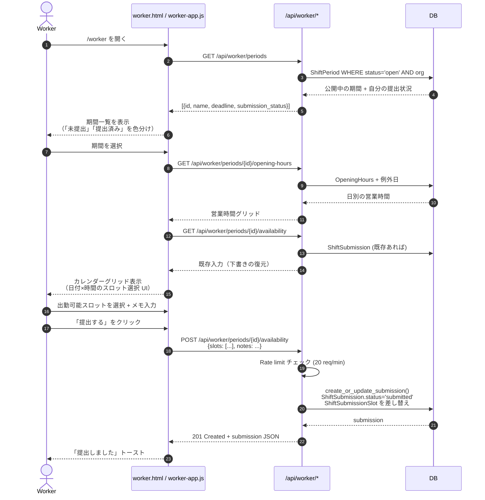
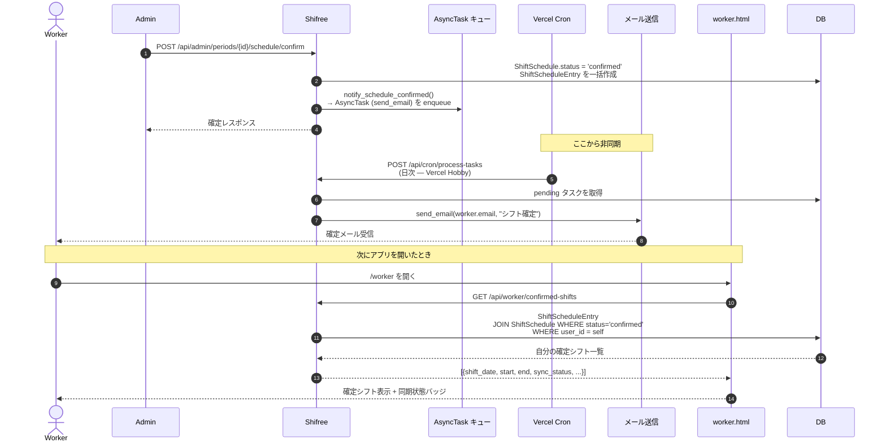
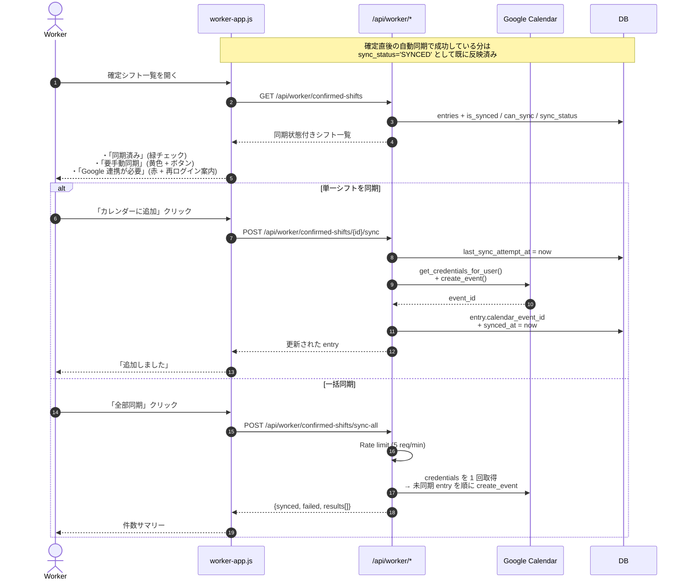

# 02. Worker の月次フロー（希望提出〜確定受領〜カレンダー反映）

Worker（シフトに入る人）が、毎月どのようにシステムを使うかのフロー。

## 登場する人間

- **Worker** — アルバイト・スタッフ。自分の出勤可能時間を提出し、確定したシフトを受け取る
- **Admin** — （このフローでは背景） 期間を公開し、最終的にシフトを確定する

## フローの全体像（3 ステージ）

1. **希望提出** — 公開された期間に対して、出勤可能なスロットを入力して送信
2. **待機 + 確定受領** — 確定通知を受け取り、自分のシフトを確認
3. **カレンダー反映** — Google カレンダーに自動 or 手動で同期

---

## ステージ 1: 希望提出

### 主な分岐

- **期間が `status='open'` でない** → 400 `VALIDATION_ERROR`（締切後やキャンセル済み）
- **別組織の期間 ID を叩いた** → 404 `NOT_FOUND`
- **再提出** — `create_or_update_submission` は既存 submission の slots を差し替える（上書き可能）

---

## ステージ 2: 待機と確定受領

Worker が提出した後、Admin がスケジュールを組んで確定するまでの間、Worker は特にシステムを触りません。確定時は **メール通知** と **Worker アプリで表示** の 2 経路で届きます。

### ポイント

- **通知と表示の独立性** — メールが届かなくても、アプリを開けば `/api/worker/confirmed-shifts` で確認できる。「メールを見逃したので出勤を忘れる」を防ぐ多重化。
- **Vercel Cron の制約** — Hobby プランは 1 日 1 回しか cron を回せないため、確定直後にメールが届くとは限らない（最大 24 時間遅延）。同期通知の性質としては「数時間以内に届けばよい」想定。

---

## ステージ 3: カレンダー反映

確定後、Google カレンダーへの同期は **自動（Admin 確定時に一括）** が基本。失敗した分だけ Worker が手動で救済します。

### 失敗時の分岐（詳細は 05-calendar-sync-recovery.md）

| エラー | HTTP | 画面表示 | 対応 |
|---|---|---|---|
| `CREDENTIALS_EXPIRED` | 401 | 「再ログインしてください」 | Worker が再ログイン |
| `NO_CREDENTIALS` | 401 | 「Google 連携未設定」 | Worker が再ログイン |
| `CALENDAR_PERMISSION_DENIED` | 500 | 「カレンダー権限が必要」 | スコープ再同意 |
| `CALENDAR_TEMPORARY_FAILURE` | 500 | 「一時的な失敗」 | 時間を置いて再試行 |

---

## ユーザー体験サマリー

| タイミング | Worker が触る場所 | Worker が目にするもの |
|---|---|---|
| 期間公開直後 | アプリ or メール | 提出依頼の通知（今後実装予定） |
| 提出中 | `/worker` の期間タブ | スロット選択 UI、既存入力の復元 |
| 提出後 | — | 提出済みラベル |
| 締切前日 | メール | `notify_submission_deadline` リマインド |
| 確定直後 | メール + `/worker` | 確定通知 + 確定シフト一覧 |
| 前日 21 時 | メール | `notify_preshift` リマインド |

## 参照

- `app/blueprints/api_worker.py:20-175` — 期間取得・提出
- `app/blueprints/api_worker.py:218-402` — 確定シフト取得 + 同期
- `app/services/shift_service.py` — `create_or_update_submission`
- `app/services/calendar_service.py` — `create_event`, `classify_calendar_error`
