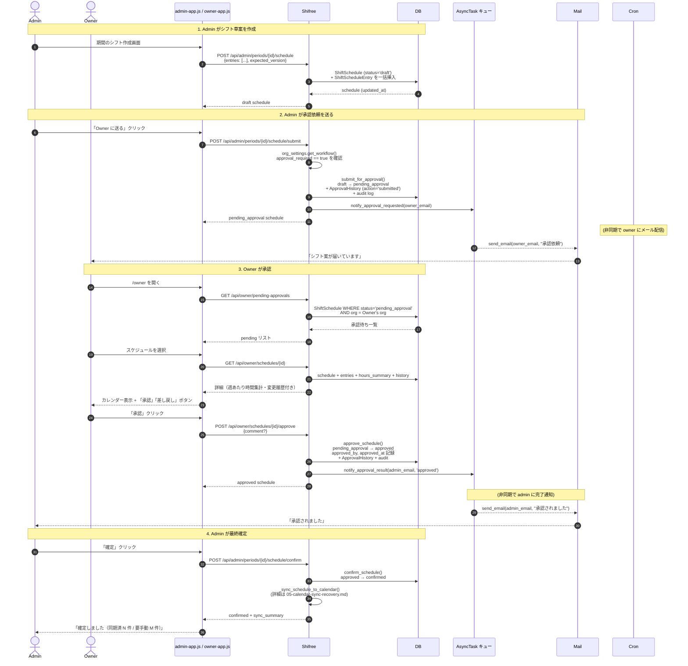
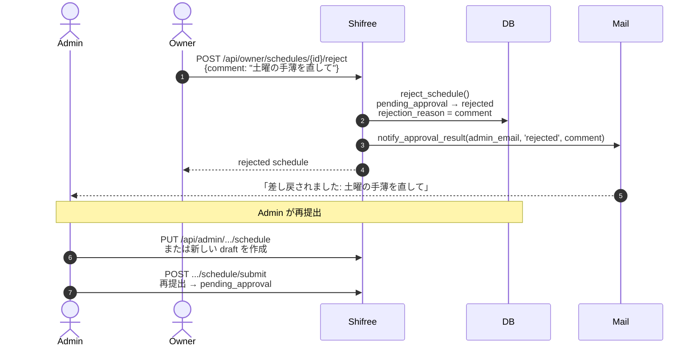
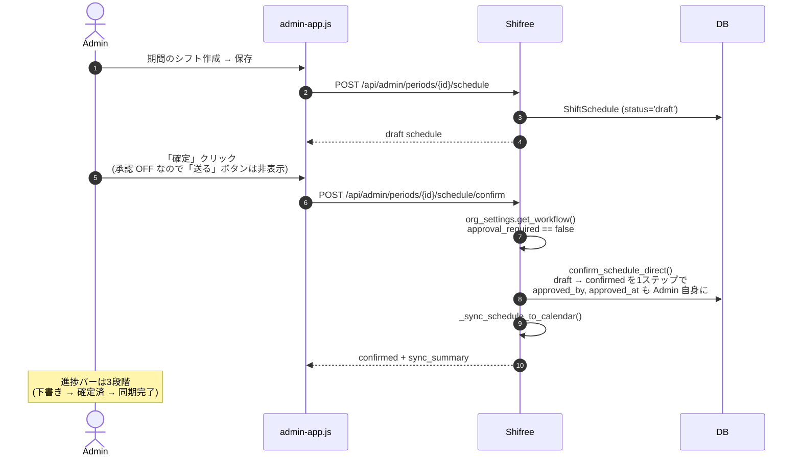

# 03. Owner 承認フロー

Admin が作ったシフトを、Owner（事業主）が承認または差し戻すフロー。組織設定 `workflow.approval_required` で **ON / OFF** が切り替えられ、運用形態が変わります。

## 登場する人間

- **Admin** — シフト原案を作成・提出する人（店長・シフト作成担当）
- **Owner** — 事業主。シフトの最終責任者として承認・却下する
- **Worker** — （このフローでは間接的）確定後に通知を受け取る

## 承認プロセスの 2 モード

| モード | `approval_required` | 状態遷移 |
|---|---|---|
| **ON（承認あり）** | `true` | `draft` → `pending_approval` → `approved` → `confirmed` |
| **OFF（承認なし）** | `false` | `draft` → `confirmed`（直接） |

デフォルトは **OFF**（新規組織）。個人経営で Admin と Owner が同一人物のケースでは承認を省略できます。Owner を別途招待した組織では ON にして権限分離。

---

## シーケンス図: 承認 ON（ハッピーパス）

### ハッピーパスで Owner/Admin が触るのは次の 3 画面だけ

- Admin 側: **期間一覧 → シフト作成 → 「送る」** の 3 ステップ
- Owner 側: **承認キュー → 詳細 → 「承認」** の 3 ステップ

---

## シーケンス図: 差し戻し（reject）

Admin は **コメント付きの差し戻し理由** をメールとアプリ両方で確認できます。再提出は同じスケジュールを編集する形でも、新しい draft を作成する形でも可能。

---

## シーケンス図: 承認 OFF（個人経営モード）

**承認 OFF のときは `/api/admin/.../schedule/submit` を呼ぶと 400 `APPROVAL_DISABLED`** が返ります。UI 側は「送る」ボタン自体を非表示にして、間違いを予防。

---

## 主要なエラー・ガード

| シチュエーション | 挙動 | エラーコード |
|---|---|---|
| Owner 以外が `/api/owner/*` を叩く | `require_role('owner')` で 403 | `FORBIDDEN` |
| 別組織のスケジュール ID を叩く | 404 | `NOT_FOUND` |
| `draft` 以外で submit | 400 | （`_transition_schedule` で検出） |
| `pending_approval` 以外で approve | 400 | `APPROVAL_ERROR` |
| 同じスケジュールを 2 回 approve | 409 相当（state mismatch） | `APPROVAL_ERROR` |
| 楽観ロック不一致 | 409 | `SCHEDULE_VERSION_MISMATCH` |
| 承認 OFF 時に submit | 400 | `APPROVAL_DISABLED` |
| 承認 ON 時に Owner が 1 人もいない | 400 | — (submit 前に設定画面で警告) |
| 承認 OFF → ON 切替時、Owner 不在 | 400 | — |
| 承認 ON → OFF 切替時、pending あり | 409 | — |
| Owner が自分自身のロールを降格 | 400 | `SELF_ROLE_CHANGE` |
| 最後の Owner を降格/削除 | 400 | `LAST_OWNER` (承認 ON 時のみ) |

---

## ユーザー体験サマリー

### Admin から見た承認プロセス

| 承認 ON | 承認 OFF |
|---|---|
| 「送る」→ メール通知 → 待機 | 「確定」をクリックすれば完了 |
| 差し戻し時はメールで理由が届く | 差し戻しという概念自体がない |
| 進捗バー: 下書き → 承認待ち → 承認済 → 確定 (4段階) | 進捗バー: 下書き → 確定 → 同期完了 (3段階) |

### Owner から見た体験

- メール: 「○○さんからシフト案の承認依頼が届きました」
- 画面: `/owner` の承認キューに常時表示
- アクション: 週あたり出勤時間のサマリーを見ながら判断して、承認 or 差し戻しコメントを入力

## 参照

- `app/blueprints/api_owner.py` — 承認・却下エンドポイント
- `app/blueprints/api_admin.py:576-644` — submit / confirm、approval_required 分岐
- `app/services/approval_service.py` — `_transition_schedule`, `submit_for_approval`, `approve_schedule`, `reject_schedule`, `confirm_schedule`, `confirm_schedule_direct`
- `app/services/organization_settings.py` — `get_workflow`, `set_workflow`
- `docs/org-structure-redesign.md` — 承認プロセス仕様の設計意図
