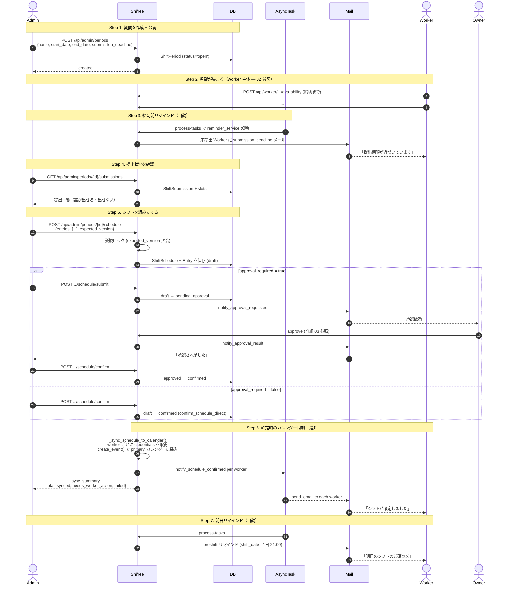
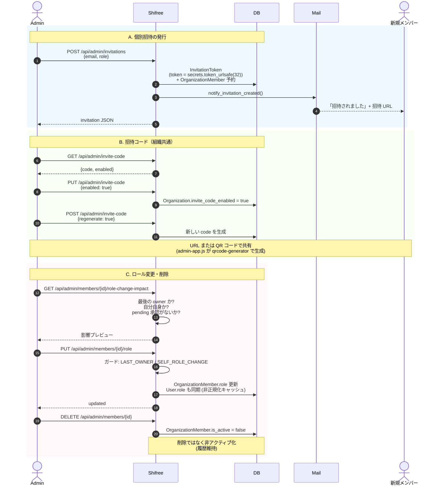
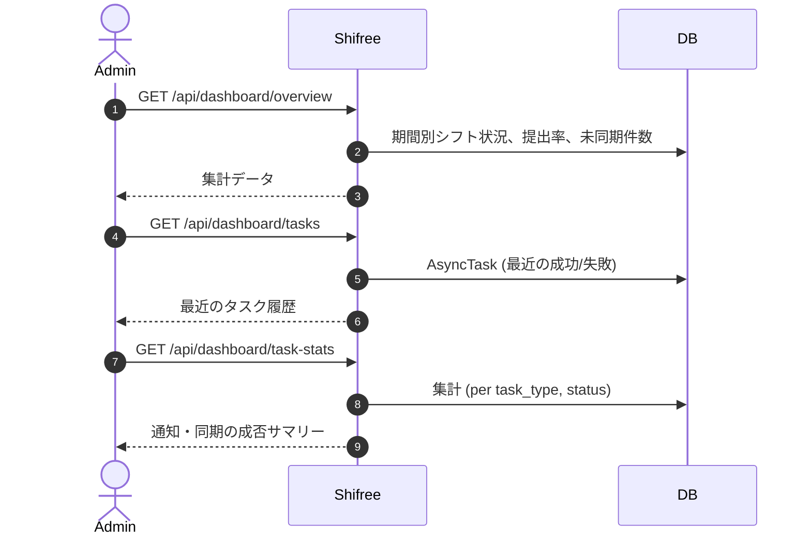

# 04. Admin のシフト運営サイクル

Admin がひと月のシフトを回すために行う一連の操作。**期間作成 → メンバー管理 → 希望集約 → シフト作成 → 確定 → 通知** の流れ。

## 登場する人間

- **Admin** — シフト作成の全体責任者
- **Worker** — 希望を提出する側（間接的）
- **Owner** — 承認 ON の場合のみ登場

## 月次サイクルの俯瞰

---

## メンバー管理（月次サイクルと並行して随時）

Worker の追加・ロール変更・退職処理。月次サイクル外でいつでも発生するので、独立したフローとして把握しておく。

### LAST_OWNER ガードと承認モードの関係

- 承認 ON のときは Owner が最低 1 人いないと submit できないので、**「最後の Owner を下ろす」操作はブロック**されます。
- 承認 OFF のときは Owner が 0 人でも運用が回るので、このガードは外れます。

---

## 設定の操作

Admin がカスタマイズできる主な設定（Phase A 以降で追加された項目）。

| 設定 | エンドポイント | 影響 |
|---|---|---|
| 営業時間 | `PUT /api/admin/opening-hours` | Worker の希望提出 UI のグリッド |
| 例外日（祝日・臨時休業） | `POST /api/admin/opening-hours/exceptions` | 同上 |
| 承認プロセス | `PUT /api/admin/settings/workflow` | `approval_required` ON/OFF |
| レベル制度 | `PUT /api/admin/settings/levels` | Worker に tier を付けて最低賃金計算等 |
| 重複チェック | `PUT /api/admin/settings/overlap-check` | シフト枠の重複を許すか |
| 最低出勤 | `PUT /api/admin/settings/min-attendance` | Worker ごとの週あたり最低出勤時間 |
| リマインド | `PUT /api/admin/settings/reminder` | 提出締切何日前の何時に送るか |

これらはすべて `Organization.settings_json` に JSON として格納。読み書きは `organization_settings.py` に集約されています。

---

## ダッシュボード（運用監視）

通知配信や同期の失敗を Admin が気付けるよう、ダッシュボードに可視化。ユーザーがサポート問い合わせする前に気づくのが狙い。

---

## ユーザー体験サマリー

### Admin がひと月に触るもの

1. **月初**: 新しい期間を作成・公開（1 分）
2. **締切前**: 提出状況を眺める、リマインドを追加送信（3-5 分）
3. **締切後**: シフトを組む（30 分〜数時間）
4. **承認後 or 直接**: 「確定」をクリック。同期結果を確認し、要手動の Worker に声をかける（5 分）
5. **随時**: メンバーの招待・ロール変更、設定調整

## 参照

- `app/blueprints/api_admin.py` 全体
- `app/services/shift_service.py` — シフト組立ロジック
- `app/services/organization_settings.py` — 各種設定の getter/setter
- `app/blueprints/api_dashboard.py` — 運用ダッシュボード
- `docs/admin-redesign-plan.md` — Admin 画面の再設計計画
