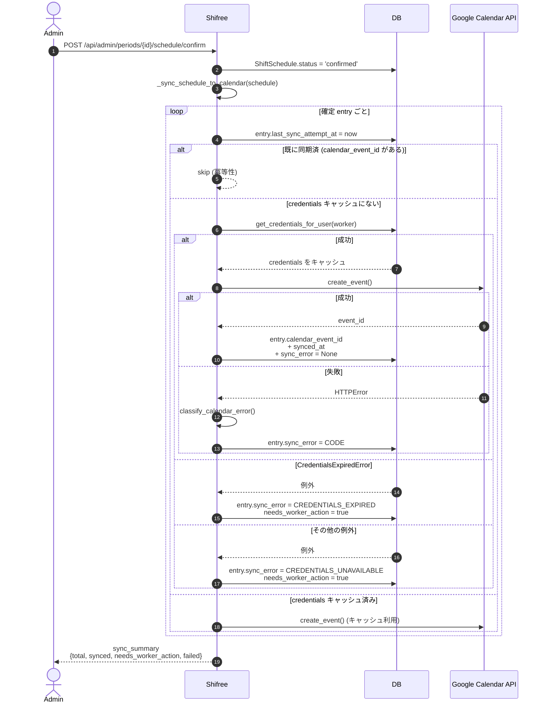
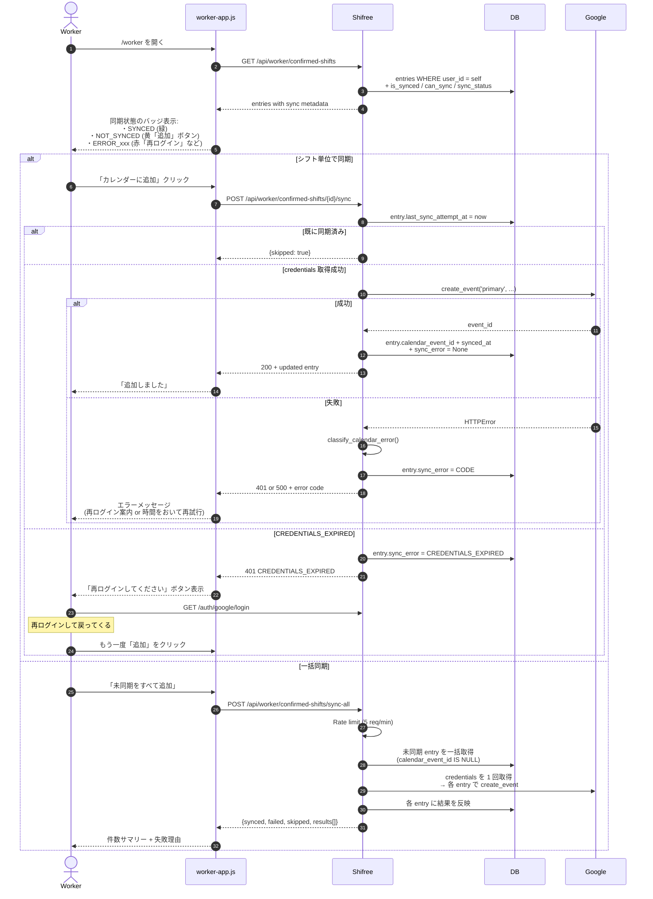
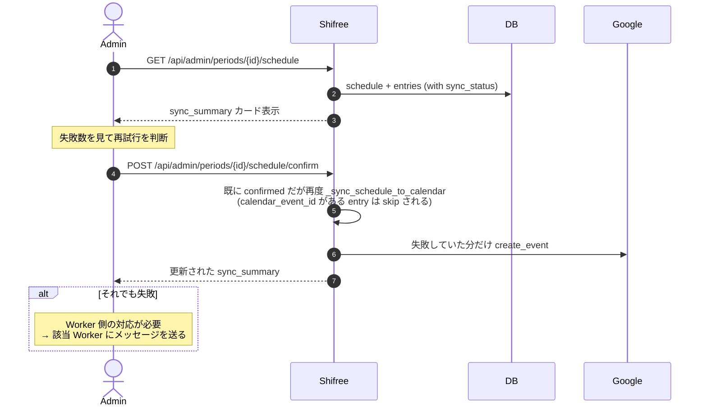
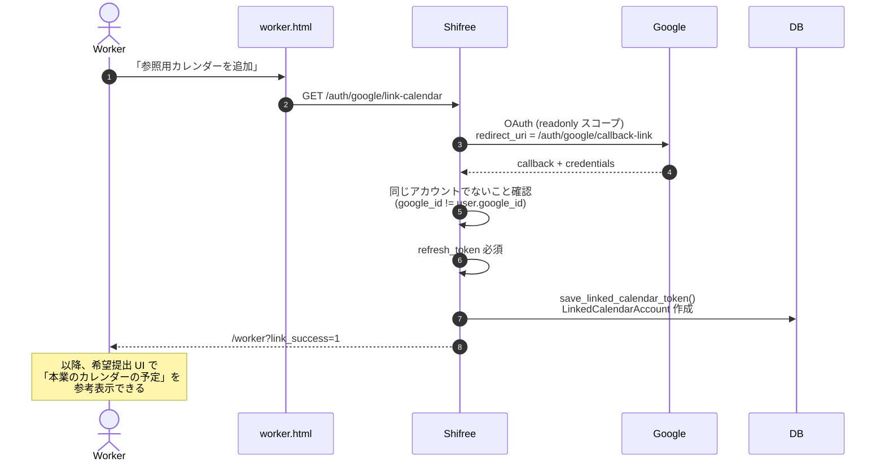

# 05. カレンダー同期の失敗回復

シフト確定時、確定した各 Worker の Google カレンダーにイベントを自動挿入します。失敗したときにどう復旧するかを、**自動同期 → 自動失敗の検出 → Worker 自力復旧 → Admin 一括再同期** の流れで描きます。

## 登場する人間

- **Admin** — シフト確定を行い、全体の同期結果を監視する
- **Worker** — 自分のカレンダーに同期できていない分を自力で追加する

## 同期の 3 経路

| 経路 | 起点 | 書き込み先 | 使う認証情報 |
|---|---|---|---|
| **自動（確定時）** | Admin の confirm | 各 Worker の primary | 各 Worker の refresh_token |
| **Worker 自力** | Worker 自身のボタン | 自分の primary | 自分の refresh_token |
| **Admin 一括再試行** | Admin の手動操作 | 各 Worker の primary | 各 Worker の refresh_token |

**ポイント**: Admin の認証情報で Worker のカレンダーに書き込むことはしません。必ず Worker 本人の credentials を使う（マルチテナント・権限分離の観点）。

---

## シーケンス図: 自動同期（確定時）

### Admin 画面の表示

確定レスポンスに `sync_summary` が含まれるので、Admin アプリでは以下のサマリーカードを表示：

- ✅ 同期済み: N 件
- ⚠️ Worker の対応が必要: M 件（氏名リスト付き）
- ❌ 失敗: K 件（原因コード付き）

`needs_worker_action` のフラグが立った Worker には、Admin から個別に「再ログインしてカレンダーを追加してください」と連絡する運用。

---

## エラー分類 (classify_calendar_error)

`app/services/calendar_service.py` の `classify_calendar_error()` が例外を以下に分類：

| エラーコード | 原因 | HTTP | Worker 側の解決方法 |
|---|---|---|---|
| `CREDENTIALS_EXPIRED` | refresh_token 失効 | 401 | 再ログイン |
| `NO_CREDENTIALS` | そもそも保存されていない | 401 | 再ログイン |
| `CREDENTIALS_UNAVAILABLE` | DB から取得失敗（稀） | 500 | 再ログイン |
| `CALENDAR_PERMISSION_DENIED` | Google 側で Calendar スコープ拒否 | 500 | OAuth 同意をやり直す |
| `CALENDAR_TEMPORARY_FAILURE` | 429 / 500 / 503 | 500 | 時間を置く |
| `CALENDAR_ERROR` | その他 | 500 | サポート問い合わせ |

---

## シーケンス図: Worker 自力復旧

### Worker から見える同期状態（`get_sync_status()` の返り値）

`ShiftScheduleEntry` モデルに実装された派生プロパティ：

- `SYNCED` — `calendar_event_id` あり、エラーなし
- `NOT_SYNCED` — `calendar_event_id` なし、エラーなし（未試行）
- `ERROR_CREDENTIALS_EXPIRED` / `ERROR_NO_CREDENTIALS` — 再ログイン必要
- `ERROR_TEMPORARY` — 一時的失敗（リトライ）
- `ERROR_OTHER` — その他

UI は状態ごとに色とアクションを分けて表示（02-worker-monthly-flow.md の Stage 3 参照）。

---

## シーケンス図: Admin 一括再同期

Admin が「失敗している分を再試行したい」ときのエンドポイントは実装上は **shift-schedule の confirm の再呼び出し** で代替できます（冪等性ガードで成功済は skip される）。

**現状の実装の注意点**: 失敗分のみを再同期する専用エンドポイントはなく、confirm を再呼び出しで代替しています。冪等性は `calendar_event_id` の存在でガードされるので安全ですが、UX 上「同期だけ再試行」ボタンを別途切り出すのが改善余地です（未実装）。

---

## LinkedCalendarAccount（読み取り専用の別アカウント連携）

Worker が **別の Google アカウントのカレンダーを参照用に追加** できる機能。書き込みは primary アカウントのみで、連携アカウントは読み取りのみ。

## 参照

- `app/services/calendar_service.py` — `create_event`, `classify_calendar_error`
- `app/blueprints/api_worker.py:218-402` — `/confirmed-shifts`, `/sync`, `/sync-all`
- `app/blueprints/api_admin.py:647-` — `_sync_schedule_to_calendar`
- `app/models/shift.py` — `ShiftScheduleEntry.is_synced`, `can_sync`, `get_sync_status`
- `app/blueprints/auth.py:369-453` — `link_calendar`, `callback_link`
- `app/models/user.py` — `LinkedCalendarAccount`
