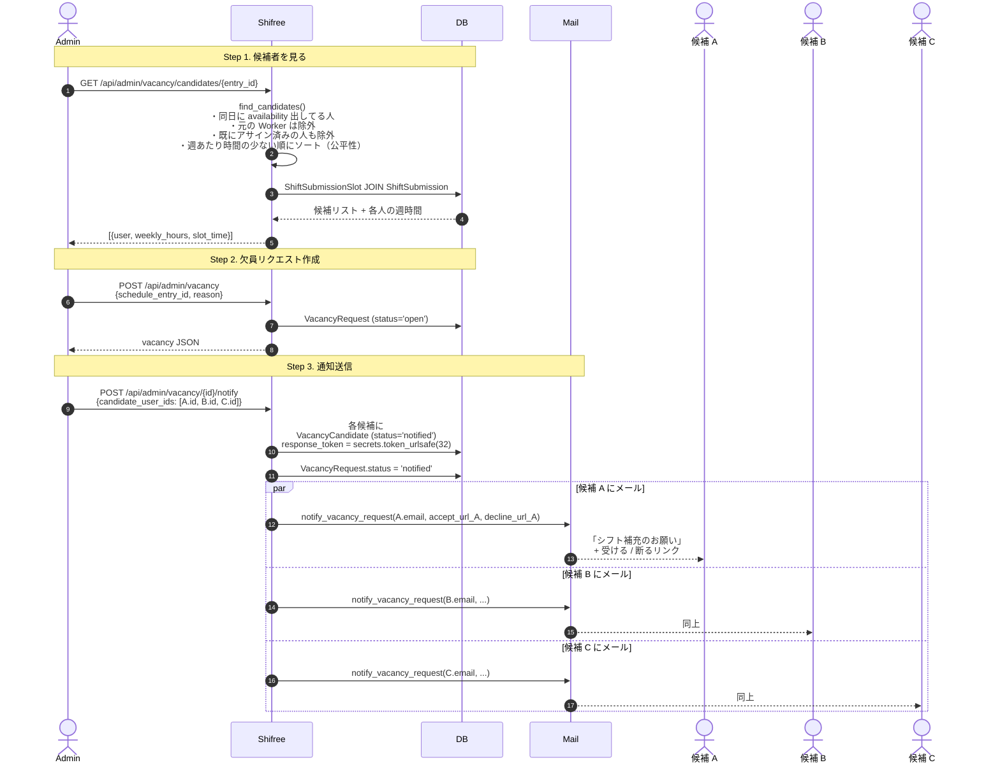
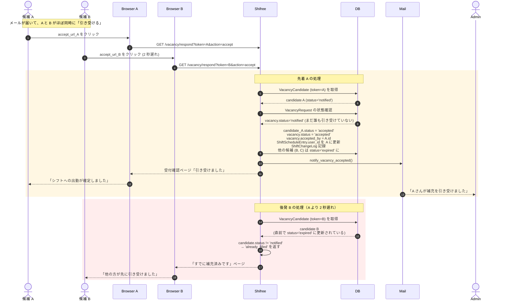
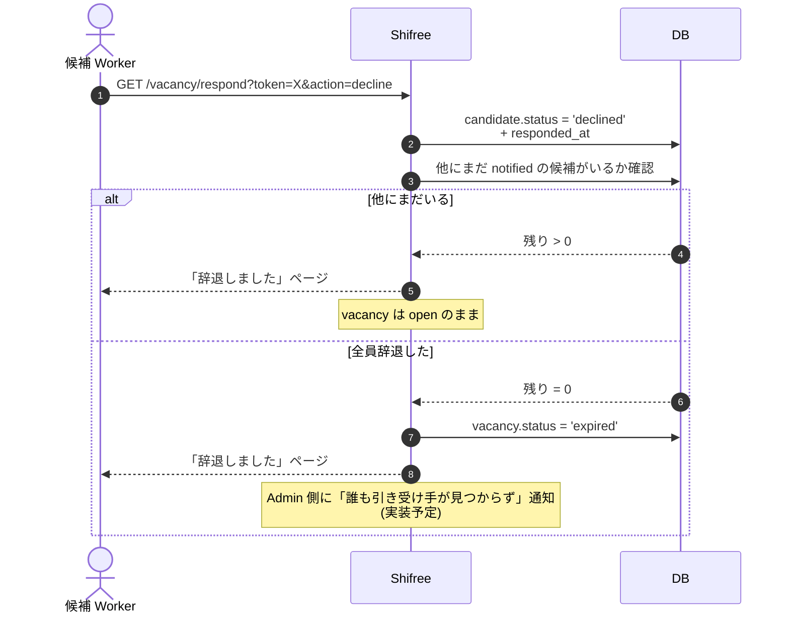
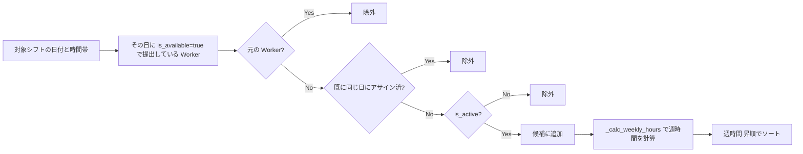

# 06. 欠員募集（Vacancy Request）

Worker が急な体調不良などで出勤できなくなったとき、**Admin が代わりの候補者を自動的に見つけてメールで募集し、最初に受けた人がそのシフトに入る** 仕組み。

## 登場する人間

- **Admin** — 欠員枠を決めて募集を開始する
- **元の Worker** — 出勤できなくなった人（オプション：自己申告の窓口は今後実装予定）
- **候補 Worker 複数人** — 希望を提出していて、その日時間が空いている人
- **新しい Worker** — 最初にメールリンクで「引き受ける」を押した人

## フロー全体

---

## Step 4. 候補者が応答する（Race condition guard が活躍）

### Race condition guard の仕組み

`respond_to_vacancy()` (`vacancy_service.py:221-`) で以下の 2 重チェック：

1. **Candidate 状態チェック** — `candidate.status in ('accepted', 'declined', 'expired')` → 既応答
2. **Vacancy 状態チェック** — `vacancy.status != 'notified'` → 誰かが先に受けた

さらに accept 処理の内部で `if vacancy.status != 'notified'` を再チェック（トランザクション内で二重 submit を防ぐ）。

**注意**: 厳密には DB ロック (SELECT FOR UPDATE) は使っていないので、本当に同時（ミリ秒レベル）の応答では競合する可能性がゼロではない。実運用では候補を 5-10 人程度に絞って通知するので、現実的には問題にならない規模を想定。

---

## 辞退 (decline)

---

## 候補抽出アルゴリズム: 公平性ソート

`find_candidates()` が返すリストは **週あたりの既アサイン時間が少ない順** に並びます。

「普段あまりシフトに入っていない人」に優先的に声がかかる設計。ただし最終的に誰が受けるかは先着順なので、機会平等の保証というより「声かけの優先順位」として機能します。

---

## ユーザー体験サマリー

| アクター | 何をするか | 何を見るか |
|---|---|---|
| Admin | 候補リストから通知先を選び送信 | 送信件数 + 応答状況ダッシュボード |
| 元 Worker | （現状は外部連絡） | 交代が決まったら通知（実装予定） |
| 候補 Worker（受ける） | メール → リンククリック | 「引き受けました」確認画面 |
| 候補 Worker（辞退） | メール → 辞退リンク | 「辞退しました」確認画面 |
| 候補 Worker（間に合わず） | メール → リンククリック | 「すでに補充済み」案内 |

### 候補者が **ログイン不要** で応答できる

`/vacancy/respond` は公開エンドポイント。`response_token` が 32 バイトの URL-safe ランダムトークンなので、メールが漏れない限り外部から引き受けを偽装される可能性は極低。

- 利点: Worker が「ログイン面倒 → 電話で返事」を回避できる
- 注意: トークンが他人に流出すると、他人が引き受けを偽装可能 — メールセキュリティに依存

---

## 参照

- `app/services/vacancy_service.py` — `find_candidates`, `create_vacancy_request`, `send_vacancy_notifications`, `respond_to_vacancy`
- `app/blueprints/api_admin.py:1078-` — 欠員系エンドポイント
- `app/blueprints/api_common.py:201-269` — 公開 `/vacancy/respond` エンドポイント
- `app/models/vacancy.py` — `VacancyRequest`, `VacancyCandidate`, `ShiftChangeLog`
