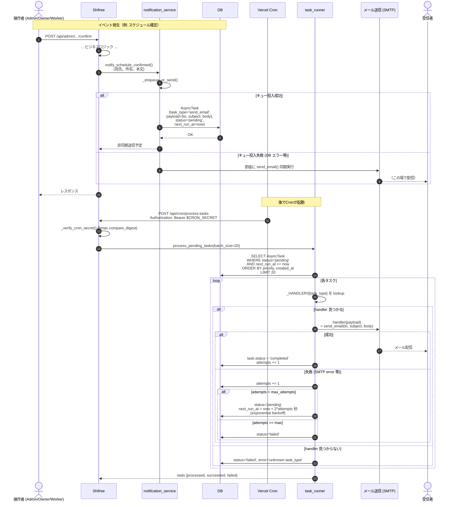
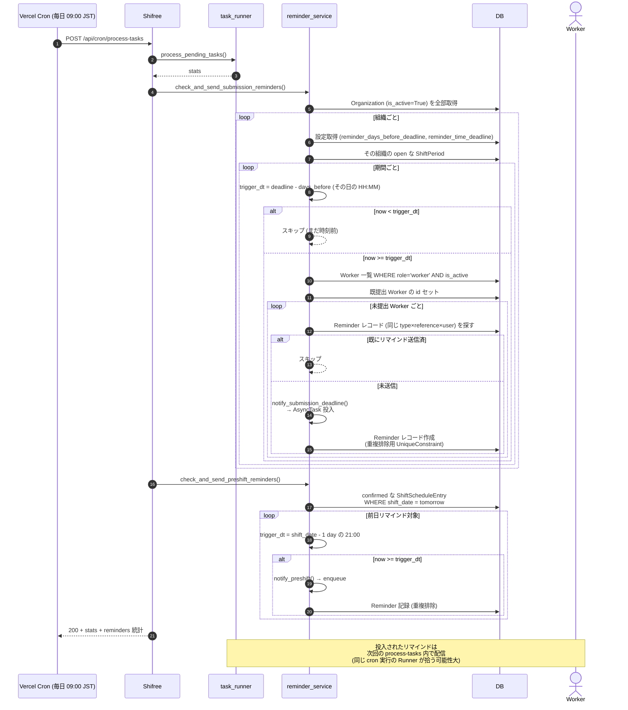
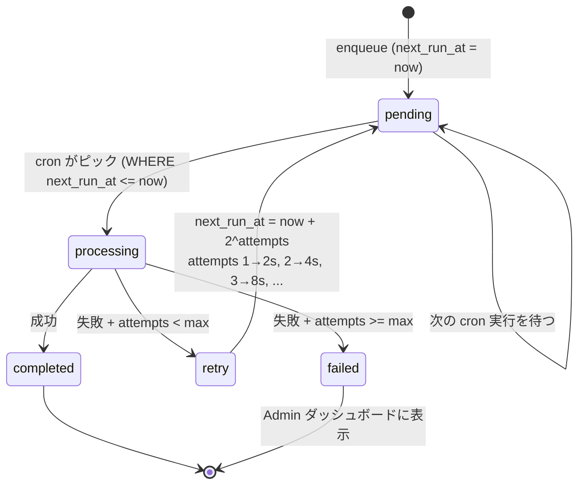
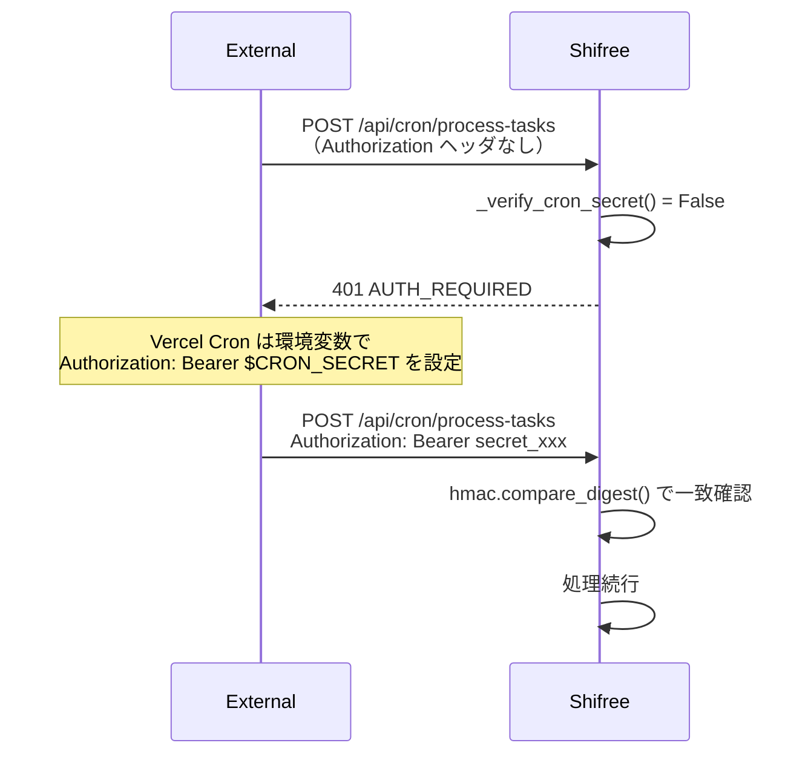

# 07. バックグラウンド処理（Cron / 通知 / リマインダー）

人間が直接触らない、**裏側で動いているジョブ** のフロー。ユーザーが送信したメッセージがどうやってメールとして届くか、提出期限のリマインドがいつ飛ぶか、を可視化します。

## 登場する要素

- **Vercel Cron** — 日次で `/api/cron/process-tasks` を叩く（外部トリガー）
- **AsyncTask キュー** — DB 上のジョブ待ち行列
- **各種 Worker/Owner/Admin** — 通知の受信者

## 通知の 2 系統

| 系統 | 起点 | 経路 |
|---|---|---|
| **イベント通知** | ユーザー操作（承認、確定、欠員発生） | `notify_*()` → `_enqueue_or_send` → キュー投入 or 同期送信 |
| **リマインダー** | 時刻到達 | Cron が `reminder_service` を呼ぶ |

---

## シーケンス図: 通知の enqueue と送信

### enqueue_or_send のフォールバック設計の意図

開発環境や DB が一時的に落ちているときでも通知が届くよう、**「キュー投入できなかったら同期送信」** のフォールバックを挟んでいます (`notification_service.py`)。本番環境では通常キュー経由で配信されますが、SMTP 未設定の場合はログに落ちるだけ（ブラック Hole にならない）。

---

## シーケンス図: リマインダー（同じ Cron 内）

Vercel Hobby プランの制約で cron は 1 日 1 回しか回せない。そのため `process-tasks` の中で **タスク処理 → リマインダー検査** を同じリクエストで実行しています。

### リマインダーの重複防止

`Reminder` テーブルに `UniqueConstraint(reminder_type, reference_id, user_id)` が張られており、同じ期間・同じユーザーに 2 回リマインドが飛ぶことがないようになっています。

### 実用上の配信時刻

- **提出締切リマインダー** — デフォルト「締切の 1 日前の 09:00」にトリガー条件を満たす → 次の cron 実行で enqueue → その cron 実行内で SMTP 配信。Vercel Cron が 09:00 JST に 1 回ヒットする設定なら、ほぼ即時に配信。
- **前日リマインダー** — デフォルト「シフト前日の 21:00」。Cron が日次 09:00 しか動いていない場合、実際には **翌朝 09:00 頃に「今日のシフトのお知らせ」として配信** されることになる。運用上は許容している（予定の再確認用）。

---

## 通知の種類一覧

実装されている通知テンプレート（`notification_service.py`）:

| 関数名 | トリガー | 受信者 | 内容 |
|---|---|---|---|
| `notify_invitation_created` | Admin が個別招待発行 | 被招待者 | 招待 URL |
| `notify_approval_requested` | Admin が schedule submit | Owner | 承認依頼 |
| `notify_approval_result` | Owner が approve/reject | Admin | 結果 + コメント |
| `notify_schedule_confirmed` | Admin が確定 | 各 Worker | 自分の確定シフト |
| `notify_submission_deadline` | Cron (締切前) | Worker | 提出依頼リマインド |
| `notify_preshift` | Cron (前日) | Worker | シフト前日のお知らせ |
| `notify_vacancy_request` | Admin が欠員募集 | 候補者 | 受付リンク |
| `notify_vacancy_accepted` | 候補者が引き受け | Admin | 補充確定通知 |

すべて同じ `_enqueue_or_send` 経路を通るので、挙動・リトライ設計は統一されています。

---

## リトライ戦略の見取り図

### 失敗タスクの扱い

`api_dashboard.py` で最近の失敗タスク一覧を取得できる。Admin は定期的にここを確認して、SMTP 設定ミスやテンプレート不備に気づく運用。

---

## CRON_SECRET による保護

`hmac.compare_digest` を使っているのでタイミング攻撃対策も入っています。`CRON_SECRET` 環境変数が設定されていない場合、デバッグモードのみ認可をスキップ（開発環境でローカル実行できるように）。

---

## ユーザー体験サマリー

ユーザーからは「バックグラウンドジョブ」という概念自体が見えない。見えるのは **メール通知** と **Admin ダッシュボードの監視画面** のみ。

| ロール | 触れる場所 | 見る情報 |
|---|---|---|
| Worker | メール受信箱 | 提出依頼・確定・前日・欠員リクエスト |
| Owner | メール受信箱 | 承認依頼 |
| Admin | メール受信箱 + `/api/dashboard/*` | 承認結果・補充確定 + タスク成否ダッシュボード |

## 参照

- `app/blueprints/api_cron.py` — Cron エントリポイント + 認証
- `app/services/task_runner.py` — handler registry + リトライ
- `app/services/reminder_service.py` — リマインダー判定ロジック
- `app/services/notification_service.py` — 各 `notify_*()` テンプレート + `_enqueue_or_send`
- `app/models/async_task.py` — AsyncTask モデル
- `app/models/reminder.py` — Reminder モデル（重複排除）
- `vercel.json` — Cron スケジュール定義
